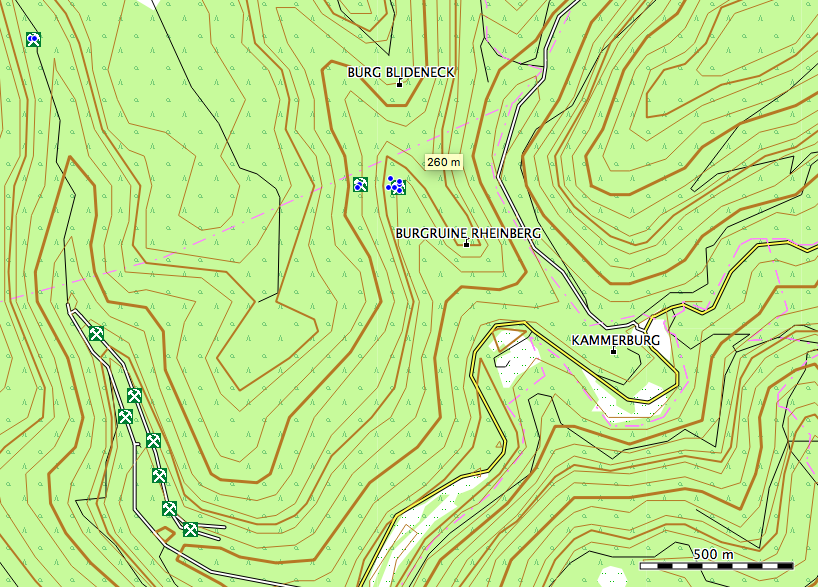

# Building Garmin Maps from OSM data.

*Status*: WIP...

## Features
- Self contained docker image for rendering osm maps for garmin devices.
- TBD

## Todo
- move lib to install
- move in garmin dir (container)
- merge styles opentopomap correctly
- FIXMEs in Makefile
- Better icon for mines

## References
- Baseline for this code: [OpenTopoMap](https://github.com/der-stefan/OpenTopoMap) 
- Input for style definitions: [MKGMAP Hiking](https://github.com/vibrog/mkgmap-hiking) 
- [OSMCONVERT](http://m.m.i24.cc/osmconvert.c)
- [MKGMAP](http://www.mkgmap.org.uk/download/mkgmap.html) and its [SPLITTER](http://www.mkgmap.org.uk/download/splitter.html)
- [phyghtmap](http://katze.tfiu.de/projects/phyghtmap/)
- Alternative download [Bike Extract SRTM OSM](https://extract.bbbike.org/)
- Freizeitkarte development environment [github](https://github.com/freizeitkarte/fzk-mde-garmin)
- Garmin Fenix 6 style files [github](https://github.com/ahotzler/garmin-fenix-6x-outdoor-typfile-AH)

## Howto adjust style
- Which points to show in which zoom level? style/opentopomap/points
- Icons in XPM style/typ/OpenTopoMap.typ

## Time
germany Total time taken: 1 hour 48 minutes 3 seconds

# Licenses
- (c) Map: FZK project (free for private use); Map data: OpenStreetMap contributors; Contour data: U.S. Geological Survey or J. de Ferranti

# Releases
- Version 0.8 baseline with workflow fzk: rlp
- Version 0.7 baseline with working bootstrap: bounds & sea
- Version 0.6 baseline with working fzk dev
- Version 0.4 starts merge with fzk development entvironment
- Version up to 0.3 works with Makefile (cf. docu in makefile itself)
